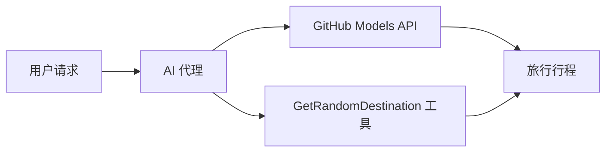

# 🌍 使用 Microsoft Agent Framework (.NET) 构建 AI 旅行代理

## 📋 场景概述

本示例演示了如何使用 Microsoft Agent Framework for .NET 构建智能旅行规划代理。该代理可以自动为全球随机目的地生成个性化的一日游行程。

### 核心能力：

- 🎲 **随机目的地选择**：使用自定义工具选择度假地点
- 🗺️ **智能行程规划**：创建详细的逐日行程
- 🔄 **实时流式响应**：支持即时响应和流式响应
- 🛠️ **自定义工具集成**：展示如何扩展代理能力

## 🔧 技术架构

### 核心技术

- **Microsoft Agent Framework**：用于 AI 代理开发的最新 .NET 实现
- **GitHub Models 集成**：使用 GitHub 的 AI 模型推理服务
- **OpenAI API 兼容性**：利用自定义端点的 OpenAI 客户端库
- **安全配置**：基于环境的 API 密钥管理

### 关键组件

1. **AIAgent**：处理对话流程的主要代理编排器
2. **自定义工具**：`GetRandomDestination()` 函数可供代理使用
3. **聊天客户端**：基于 GitHub Models 的对话界面
4. **流式支持**：实时响应生成能力

### 集成模式



## 🚀 快速开始

### 前置条件

- [.NET 10 SDK](https://dotnet.microsoft.com/download/dotnet/10.0) 或更高版本
- [GitHub Models API 访问令牌](https://docs.github.com/github-models/github-models-at-scale/using-your-own-api-keys-in-github-models)

### 所需环境变量

```bash
# zsh/bash
export GH_TOKEN=<your_github_token>
export GH_ENDPOINT=https://models.github.ai/inference
export GH_MODEL_ID=openai/gpt-5-mini
```

```powershell
# PowerShell
$env:GH_TOKEN = "<your_github_token>"
$env:GH_ENDPOINT = "https://models.github.ai/inference"
$env:GH_MODEL_ID = "openai/gpt-5-mini"
```

### 示例代码

要运行代码示例，

```bash
# zsh/bash
chmod +x ./01-dotnet-agent-framework.cs
./01-dotnet-agent-framework.cs
```

或使用 dotnet CLI：

```bash
dotnet run ./01-dotnet-agent-framework.cs
```

完整的代码请参阅 [`01-dotnet-agent-framework.cs`](./01-dotnet-agent-framework.cs)。

```csharp
#!/usr/bin/dotnet run

#:package Microsoft.Extensions.AI@9.*
#:package Microsoft.Agents.AI.OpenAI@1.*-*

using System.ClientModel;
using System.ComponentModel;

using Microsoft.Agents.AI;
using Microsoft.Extensions.AI;

using OpenAI;

// 工具函数：随机目的地生成器
// 这个静态方法将作为可调用工具供代理使用
// [Description] 属性帮助 AI 理解何时使用此函数
// 这展示了如何为 AI 代理创建自定义工具
[Description("提供一个随机的度假目的地。")]
static string GetRandomDestination()
{
    // 全球热门度假目的地列表
    // 代理将从这些选项中随机选择
    var destinations = new List<string>
    {
        "法国巴黎",
        "日本东京",
        "美国纽约",
        "澳大利亚悉尼",
        "意大利罗马",
        "西班牙巴塞罗那",
        "南非开普敦",
        "巴西里约热内卢",
        "泰国曼谷",
        "加拿大温哥华"
    };

    // 生成随机索引并返回选中的目的地
    // 使用 System.Random 进行简单随机选择
    var random = new Random();
    int index = random.Next(destinations.Count);
    return destinations[index];
}

// 从环境变量提取配置
// 获取 GitHub Models API 端点，未指定时默认为 https://models.github.ai/inference
// 获取模型 ID，未指定时默认为 openai/gpt-5-mini
// 获取 GitHub 令牌进行身份验证，未指定时抛出异常
var github_endpoint = Environment.GetEnvironmentVariable("GH_ENDPOINT") ?? "https://models.github.ai/inference";
var github_model_id = Environment.GetEnvironmentVariable("GH_MODEL_ID") ?? "openai/gpt-5-mini";
var github_token = Environment.GetEnvironmentVariable("GH_TOKEN") ?? throw new InvalidOperationException("GH_TOKEN is not set.");

// 配置 OpenAI 客户端选项
// 创建配置选项以指向 GitHub Models 端点
// 这将 OpenAI 客户端调用重定向到 GitHub 的模型推理服务
var openAIOptions = new OpenAIClientOptions()
{
    Endpoint = new Uri(github_endpoint)
};

// 使用 GitHub Models 配置初始化 OpenAI 客户端
// 使用 GitHub 令牌进行身份验证创建 OpenAI 客户端
// 配置为使用 Git Models 端点而非直接使用 OpenAI
var openAIClient = new OpenAIClient(new ApiKeyCredential(github_token), openAIOptions);

// 创建具有旅行规划能力的 AI 代理
// 初始化 OpenAI 客户端，获取指定模型的聊天客户端，并创建 AI 代理
// 配置代理的旅行规划指令和随机目的地工具
// 代理现在可以使用 GetRandomDestination 函数规划行程
AIAgent agent = openAIClient
    .GetChatClient(github_model_id)
    .CreateAIAgent(
        instructions: "你是一个有用的 AI 代理，可以帮助客户在随机目的地规划度假",
        tools: [AIFunctionFactory.Create(GetRandomDestination)]
    );

// 执行代理：规划一日游
// 使用流式启用运行代理以实时显示响应
// 展示代理在生成内容时的思考和响应
// 通过即时反馈提供更好的用户体验
await foreach (var update in agent.RunStreamingAsync("帮我规划一日游"))
{
    await Task.Delay(10);
    Console.Write(update);
}
```

## 🎓 关键要点

1. **代理架构**：Microsoft Agent Framework 为在 .NET 中构建 AI 代理提供了清晰、类型安全的方法
2. **工具集成**：带有 `[Description]` 属性装饰的函数成为代理的可用水用工具
3. **配置管理**：环境变量和安全凭证处理遵循 .NET 最佳实践
4. **OpenAI 兼容性**：GitHub Models 集成通过 OpenAI 兼容 API 无缝工作

## 🔗 额外资源

- [Microsoft Agent Framework 文档](https://learn.microsoft.com/agent-framework)
- [GitHub Models 市场](https://github.com/marketplace?type=models)
- [Microsoft.Extensions.AI](https://learn.microsoft.com/dotnet/ai/microsoft-extensions-ai)
- [.NET 单文件应用](https://devblogs.microsoft.com/dotnet/announcing-dotnet-run-app)
