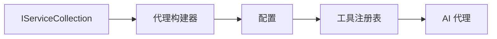

# 🎨 使用 GitHub Models 的代理设计模式 (.NET)

## 📋 学习目标

本示例演示了使用 .NET 中的 Microsoft Agent Framework 与 GitHub Models 集成的企业级设计模式。你将学习使代理具有生产就绪性、可维护性和可扩展性的专业模式和架构方法。

### 企业设计模式

- 🏭 **工厂模式**：使用依赖注入的标准化代理创建
- 🔧 **构建器模式**：流畅的代理配置和设置
- 🧵 **线程安全模式**：并发对话管理
- 📋 **仓储模式**：有序的工具和能力管理

## 🎯 .NET 特定架构优势

### 企业特性

- **强类型**：编译时验证和 IntelliSense 支持
- **依赖注入**：内置 DI 容器集成
- **配置管理**：IConfiguration 和 Options 模式
- **Async/Await**：一流异步编程支持

### 生产就绪模式

- **日志集成**：ILogger 和结构化日志支持
- **健康检查**：内置监控和诊断
- **配置验证**：使用数据注解的强类型
- **错误处理**：结构化异常管理

## 🔧 技术架构

### 核心 .NET 组件

- **Microsoft.Extensions.AI**：统一 AI 服务抽象
- **Microsoft.Agents.AI**：企业代理编排框架
- **GitHub Models 集成**：高性能 API 客户端模式
- **配置系统**：appsettings.json 和环境集成

### 设计模式实现



## 🏗️ 演示的企业模式

### 1. **创建模式**

- **代理工厂**：集中式代理创建，具有一致配置
- **构建器模式**：复杂代理配置的流畅 API
- **单例模式**：共享资源和配置管理
- **依赖注入**：松耦合和可测试性

### 2. **行为模式**

- **策略模式**：可互换的工具执行策略
- **命令模式**：具有撤销/重做的封装代理操作
- **观察者模式**：事件驱动的代理生命周期管理
- **模板方法**：标准化代理执行工作流

### 3. **结构模式**

- **适配器模式**：GitHub Models API 集成层
- **装饰器模式**：代理能力增强
- **外观模式**：简化的代理交互接口
- **代理模式**：延迟加载和缓存以提高性能

## 📚 .NET 设计原则

### SOLID 原则

- **单一职责**：每个组件有一个清晰的目的
- **开闭原则**：可扩展而无需修改
- **里氏替换**：基于接口的工具实现
- **接口隔离**：专注、内聚的接口
- **依赖倒置**：依赖抽象而非具体

### 清洁架构

- **领域层**：核心代理和工具抽象
- **应用层**：代理编排和工作流
- **基础设施层**：GitHub Models 集成和外部服务
- **表现层**：用户交互和响应格式化

## 🔒 企业考虑

### 安全性

- **凭证管理**：使用 IConfiguration 的安全 API 密钥处理
- **输入验证**：强类型和数据注解验证
- **输出清理**：安全响应处理和过滤
- **审计日志**：全面的操作跟踪

### 性能

- **异步模式**：非阻塞 I/O 操作
- **连接池**：高效的 HTTP 客户端管理
- **缓存**：改进性能的响应缓存
- **资源管理**：正确的 disposal 和清理模式

### 可扩展性

- **线程安全**：并发代理执行支持
- **资源池**：高效的资源利用
- **负载管理**：速率限制和背压处理
- **监控**：性能指标和健康检查

## 🚀 生产部署

- **配置管理**：环境特定设置
- **日志策略**：带关联 ID 的结构化日志
- **错误处理**：具有适当恢复的全局异常处理
- **监控**：应用洞察和性能计数器
- **测试**：单元测试、集成测试和负载测试模式

准备好用 .NET 构建企业级智能代理了吗？让我们构建一些强大的架构！🏢✨

## 🚀 快速开始

### 前置条件

- [.NET 10 SDK](https://dotnet.microsoft.com/download/dotnet/10.0) 或更高版本
- [GitHub Models API 访问令牌](https://docs.github.com/github-models/github-models-at-scale/using-your-own-api-keys-in-github-models)

### 所需环境变量

```bash
# zsh/bash
export GH_TOKEN=<your_github_token>
export GH_ENDPOINT=https://models.github.ai/inference
export GH_MODEL_ID=openai/gpt-5-mini
```

```powershell
# PowerShell
$env:GH_TOKEN = "<your_github_token>"
$env:GH_ENDPOINT = "https://models.github.ai/inference"
$env:GH_MODEL_ID = "openai/gpt-5-mini"
```

### 示例代码

要运行代码示例，

```bash
# zsh/bash
chmod +x ./03-dotnet-agent-framework.cs
./03-dotnet-agent-framework.cs
```

或使用 dotnet CLI：

```bash
dotnet run ./03-dotnet-agent-framework.cs
```

完整的代码请参阅 [`03-dotnet-agent-framework.cs`](./03-dotnet-agent-framework.cs)。

```csharp
#!/usr/bin/dotnet run

#:package Microsoft.Extensions.AI@10.*
#:package Microsoft.Agents.AI.OpenAI@1.*-*

using System.ClientModel;
using System.ComponentModel;

using Microsoft.Agents.AI;
using Microsoft.Extensions.AI;

using OpenAI;

// 工具函数：随机目的地生成器
// 这个静态方法将作为可调用工具供代理使用
// [Description] 属性帮助 AI 理解何时使用此函数
// 这展示了如何为 AI 代理创建自定义工具
[Description("提供一个随机的度假目的地。")]
static string GetRandomDestination()
{
    // 全球热门度假目的地列表
    // 代理将从这些选项中随机选择
    var destinations = new List<string>
    {
        "法国巴黎",
        "日本东京",
        "美国纽约",
        "澳大利亚悉尼",
        "意大利罗马",
        "西班牙巴塞罗那",
        "南非开普敦",
        "巴西里约热内卢",
        "泰国曼谷",
        "加拿大温哥华"
    };

    // 生成随机索引并返回选中的目的地
    // 使用 System.Random 进行简单随机选择
    var random = new Random();
    int index = random.Next(destinations.Count);
    return destinations[index];
}

// 从环境变量提取配置
// 获取 GitHub Models API 端点，未指定时默认为 https://models.github.ai/inference
// 获取模型 ID，未指定时默认为 openai/gpt-5-mini
// 获取 GitHub 令牌进行身份验证，未指定时抛出异常
var github_endpoint = Environment.GetEnvironmentVariable("GH_ENDPOINT") ?? "https://models.github.ai/inference";
var github_model_id = Environment.GetEnvironmentVariable("GH_MODEL_ID") ?? "openai/gpt-5-mini";
var github_token = Environment.GetEnvironmentVariable("GH_TOKEN") ?? throw new InvalidOperationException("GH_TOKEN is not set.");

// 配置 OpenAI 客户端选项
// 创建配置选项以指向 GitHub Models 端点
// 这将 OpenAI 客户端调用重定向到 GitHub 的模型推理服务
var openAIOptions = new OpenAIClientOptions()
{
    Endpoint = new Uri(github_endpoint)
};

// 使用 GitHub Models 配置初始化 OpenAI 客户端
// 使用 GitHub 令牌进行身份验证创建 OpenAI 客户端
// 配置为使用 GitHub Models 端点而非直接使用 OpenAI
var openAIClient = new OpenAIClient(new ApiKeyCredential(github_token), openAIOptions);

// 定义代理身份和详细指令
// 用于识别和日志记录的代理名称
var AGENT_NAME = "TravelAgent";

// 定义代理个性、能力和行为的详细指令
// 此系统提示塑造了代理如何响应和与用户交互
var AGENT_INSTRUCTIONS = """
你是一个有用的 AI 代理，可以帮助客户规划度假。

重要提示：当用户指定目的地时，始终为该地点进行规划。只有在用户没有指定偏好时才建议随机目的地。

对话开始时，请使用以下消息进行自我介绍：
"你好！我是你的 TravelAgent 助手。我可以帮助你规划度假并为你推荐有趣的目的地。你可以问我以下问题：
1. 为特定地点规划一日游
2. 推荐一个随机度假目的地
3. 找到具有特定特征的目的地（海滩、山脉、历史遗迹等）
4. 如果你不喜欢我的第一个建议，规划替代行程

你今天想让我帮你规划什么样的旅行？"

始终优先考虑用户偏好。如果他们提到特定目的地，如"巴厘岛"或"巴黎"，请专注于为该地点进行规划，而不是建议替代方案。
""";

// 创建具有高级旅行规划能力的 AI 代理
// 初始化完整的代理管道：OpenAI 客户端 → 聊天客户端 → AI 代理
// 配置代理的名称、详细指令和可用工具
// 这展示了带有完整配置的 .NET 代理创建模式
AIAgent agent = openAIClient
    .GetChatClient(github_model_id)
    .CreateAIAgent(
        name: AGENT_NAME,
        instructions: AGENT_INSTRUCTIONS,
        tools: [AIFunctionFactory.Create(GetRandomDestination)]
    );

// 创建新的对话线程用于上下文管理
// 初始化新的对话线程以在多次交互中维护上下文
// 线程使代理能够记住之前的交换并维护对话状态
// 这对于多轮对话和上下文理解至关重要
AgentThread thread = agent.GetNewThread();

// 执行代理：第一次旅行规划请求
// 使用可能触发随机目的地工具的初始请求运行代理
// 代理将分析请求，使用 GetRandomDestination 工具，并创建行程
// 使用 thread 参数为后续交互维护对话上下文
await foreach (var update in agent.RunStreamingAsync("帮我规划一日游", thread))
{
    await Task.Delay(10);
    Console.Write(update);
}

Console.WriteLine();

// 执行代理：具有上下文感知的跟进请求
// 通过引用之前的响应展示上下文对话
// 代理会记住之前的目的地建议并提供替代方案
// 这展示了 .NET 代理中对话线程和上下文理解的力量
await foreach (var update in agent.RunStreamingAsync("我不喜欢那个目的地。帮我规划另一个度假。", thread))
{
    await Task.Delay(10);
    Console.Write(update);
}
```
