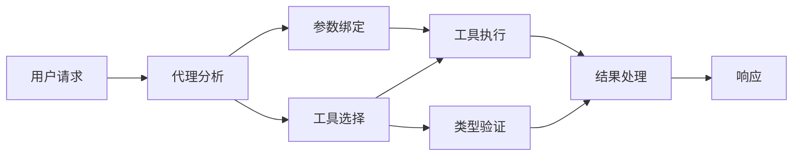

# 🛠️ 使用 GitHub Models 实现高级工具调用 (.NET)

## 📋 学习目标

本教程演示了如何使用 Microsoft Agent Framework for .NET 与 GitHub Models 构建企业级工具集成模式。你将学习如何使用多个专业工具构建复杂的代理，充分利用 C# 的强类型和 .NET 的企业级特性。

### 你将掌握的高级工具能力

- 🔧 **多工具架构**：构建具有多种专业能力的代理
- 🎯 **类型安全的工具执行**：利用 C# 的编译时验证
- 📊 **企业工具模式**：生产级工具设计和错误处理
- 🔗 **工具组合**：组合工具以完成复杂的业务工作流

## 🎯 .NET 工具架构优势

### 企业级工具特性

- **编译时验证**：强类型确保工具参数正确
- **依赖注入**：IoC 容器集成用于工具管理
- **异步模式**：正确的资源管理的非阻塞工具执行
- **结构化日志**：内置日志集成用于工具执行监控

### 生产就绪模式

- **异常处理**：使用类型化异常的综合错误管理
- **资源管理**：正确的 disposal 模式和内存管理
- **性能监控**：内置指标和性能计数器
- **配置管理**：带验证的类型安全配置

## 🔧 技术架构

### 核心 .NET 工具组件

- **Microsoft.Extensions.AI**：统一的工具抽象层
- **Microsoft.Agents.AI**：企业级工具编排
- **GitHub Models 集成**：带连接池的高性能 API 客户端

### 工具执行流程



## 🛠️ 工具类别与模式

### 1. **数据处理工具**

- **输入验证**：使用数据注解的强类型
- **转换操作**：类型安全的数据转换和格式化
- **业务逻辑**：领域特定的计算和分析工具
- **输出格式化**：结构化响应生成

### 2. **集成工具**

- **API 连接器**：使用 HttpClient 的 RESTful 服务集成
- **数据库工具**：用于数据访问的 Entity Framework 集成
- **文件操作**：带验证的安全文件系统操作
- **外部服务**：第三方服务集成模式

### 3. **实用工具**

- **文本处理**：字符串操作和格式化工具
- **日期/时间操作**：文化感知的日期/时间计算
- **数学工具**：精确计算和统计操作
- **验证工具**：业务规则验证和数据验证

准备好在 .NET 中构建具有强大、类型安全工具能力的企业级代理了吗？让我们来设计一些专业级的解决方案！🏢⚡

## 🚀 入门

### 前置条件

- [.NET 10 SDK](https://dotnet.microsoft.com/download/dotnet/10.0) 或更高版本
- [GitHub Models API 访问令牌](https://docs.github.com/github-models/github-models-at-scale/using-your-own-api-keys-in-github-models)

### 所需环境变量

```bash
# zsh/bash
export GH_TOKEN=<your_github_token>
export GH_ENDPOINT=https://models.github.ai/inference
export GH_MODEL_ID=openai/gpt-5-mini
```

```powershell
# PowerShell
$env:GH_TOKEN = "<your_github_token>"
$env:GH_ENDPOINT = "https://models.github.ai/inference"
$env:GH_MODEL_ID = "openai/gpt-5-mini"
```

### 示例代码

运行代码示例：

```bash
# zsh/bash
chmod +x ./04-dotnet-agent-framework.cs
./04-dotnet-agent-framework.cs
```

或使用 dotnet CLI：

```bash
dotnet run ./04-dotnet-agent-framework.cs
```

查看 [`04-dotnet-agent-framework.cs`](./04-dotnet-agent-framework.cs) 获取完整代码。

```csharp
#!/usr/bin/dotnet run

#:package Microsoft.Extensions.AI@10.*
#:package Microsoft.Agents.AI.OpenAI@1.*-*

using System.ClientModel;
using System.ComponentModel;

using Microsoft.Agents.AI;
using Microsoft.Extensions.AI;

using OpenAI;

// 工具函数：随机目的地生成器
// 这个静态方法将作为可调用工具提供给代理
// [Description] 属性帮助 AI 理解何时使用此函数
// 这展示了如何为 AI 代理创建自定义工具
[Description("提供一个随机度假目的地。")]
static string GetRandomDestination()
{
    // 全球热门度假目的地列表
    // 代理将随机选择这些选项
    var destinations = new List<string>
    {
        "法国巴黎",
        "日本东京",
        "美国纽约",
        "澳大利亚悉尼",
        "意大利罗马",
        "西班牙巴塞罗那",
        "南非开普敦",
        "巴西里约热内卢",
        "泰国曼谷",
        "加拿大温哥华"
    };

    // 生成随机索引并返回选中的目的地
    // 使用 System.Random 进行简单随机选择
    var random = new Random();
    int index = random.Next(destinations.Count);
    return destinations[index];
}

// 从环境变量提取配置
// 获取 GitHub Models API 端点，未指定时默认为 https://models.github.ai/inference
// 获取模型 ID，未指定时默认为 openai/gpt-5-mini
// 获取用于认证的 GitHub 令牌，未指定时抛出异常
var github_endpoint = Environment.GetEnvironmentVariable("GH_ENDPOINT") ?? "https://models.github.ai/inference";
var github_model_id = Environment.GetEnvironmentVariable("GH_MODEL_ID") ?? "openai/gpt-5-mini";
var github_token = Environment.GetEnvironmentVariable("GH_TOKEN") ?? throw new InvalidOperationException("GH_TOKEN is not set.");

// 配置 OpenAI 客户端选项
// 创建配置选项以指向 GitHub Models 端点
// 这会将 OpenAI 客户端调用重定向到 GitHub 的模型推理服务
var openAIOptions = new OpenAIClientOptions()
{
    Endpoint = new Uri(github_endpoint)
};

// 使用 GitHub Models 配置初始化 OpenAI 客户端
// 使用 GitHub 令牌进行认证创建 OpenAI 客户端
// 配置为使用 GitHub Models 端点而非直接使用 OpenAI
var openAIClient = new OpenAIClient(new ApiKeyCredential(github_token), openAIOptions);

// 定义代理身份和详细指令
// 用于识别和日志记录的代理名称
var AGENT_NAME = "TravelAgent";

// 定义代理个性、能力和行为的详细指令
// 此系统提示塑造了代理如何响应和与用户交互
var AGENT_INSTRUCTIONS = """
你是一个可以帮助客户规划度假的有用 AI 代理。

重要提示：当用户指定目的地时，始终为该地点进行规划。只有在用户未指定偏好时才建议随机目的地。

对话开始时，请使用以下消息进行自我介绍：
"你好！我是你的 TravelAgent 助手。我可以帮助你规划度假并为你推荐有趣的目的地。你可以问我以下问题：
1. 为特定地点规划一日游
2. 推荐随机度假目的地
3. 查找具有特定特征的目的地（海滩、山脉、历史遗迹等）
4. 如果你不喜欢我的第一个建议，规划替代行程

今天你想让我帮你规划什么样的旅行？"

始终优先考虑用户偏好。如果他们提到特定目的地如"巴厘岛"或"巴黎"，请专注于为该地点进行规划，而不是建议替代方案。
""";

// 创建具有高级旅行规划功能的 AI 代理
// 初始化完整代理管道：OpenAI 客户端 → 聊天客户端 → AI 代理
// 配置代理名称、详细指令和可用工具
// 这展示了带有完整配置的 .NET 代理创建模式
AIAgent agent = openAIClient
    .GetChatClient(github_model_id)
    .CreateAIAgent(
        name: AGENT_NAME,
        instructions: AGENT_INSTRUCTIONS,
        tools: [AIFunctionFactory.Create(GetRandomDestination)]
    );

// 创建新对话线程以进行上下文管理
// 初始化新对话线程以在多次交互中维护上下文
// 线程使代理能够记住之前的交换并维护对话状态
// 这对于多轮对话和上下文理解至关重要
AgentThread thread = agent.GetNewThread();

// 执行代理：第一个旅行规划请求
// 使用可能触发随机目的地工具的初始请求运行代理
// 代理将分析请求，使用 GetRandomDestination 工具，并创建行程
// 使用 thread 参数维护后续交互的对话上下文
await foreach (var update in agent.RunStreamingAsync("帮我规划一日游", thread))
{
    await Task.Delay(10);
    Console.Write(update);
}

Console.WriteLine();

// 执行代理：带有上下文感知的后续请求
// 通过引用之前的响应展示上下文对话
// 代理会记住之前的目的地建议并提供替代方案
// 这展示了 .NET 代理中对话线程和上下文理解的力量
await foreach (var update in agent.RunStreamingAsync("我不喜欢那个目的地。帮我规划另一个度假行程。", thread))
{
    await Task.Delay(10);
    Console.Write(update);
}
```
